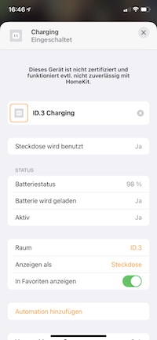
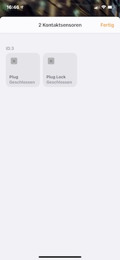
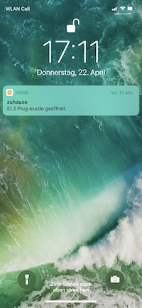

# VWsFriend
[](https://github.com/tillsteinbach/VWsFriend/actions/workflows/build.yml)

Volkswagen WeConnect© API visualization and control inspired by TeslaMate https://docs.teslamate.org/

## What it looks like


## Requirements
* Docker (if you are new to Docker, see [Installing Docker and Docker Compose](https://dev.to/rohansawant/installing-docker-and-docker-compose-on-the-raspberry-pi-in-5-simple-steps-3mgl))
* A Machine that's always on, so VWsFriend can continually fetch data
* External internet access, to talk to the servers

## How to start
* Clone or download the files [docker-compose.yml](./docker-compose.yml) and [.env](./.env)
* To create myconfig.env copy [.env](./.env) file and make changes according to your needs
* Start the stack using your configuration.
```bash
docker-compose --env-file ./myconfig.env up
```

* Open a browser to use the webinterface on http://IP-ADDRESS:4000
* Open a browser to use grafana on http://IP-ADDRESS:3000 with the user and password you selected

## More information
More information can be found in the Wiki: https://github.com/tillsteinbach/VWsFriend/wiki

## Update
* To update the running VWsFriend configuration to the latest version, run the following commands:
```bash
docker-compose pull
docker-compose --env-file ./myconfig.env up
```

## VWsFriend with Apple Homekit support


* Replace the docker-compose file by [docker-compose-homekit-host.yml](./docker-compose-homekit-host.yml) to use the homekit override
```bash
docker-compose -f docker-compose-homekit-host.yml
```
This will use host mode for vwsfriend. This is necessary as the bridge mode will not forward multicast which is necessary for Homekit to work.
If you do not like to share the host network with vwsfriend you can use macvlan mode [docker-compose-homekit-macvlan.yml](./docker-compose-homekit-macvlan.yml):
```bash
docker-compose -f docker-compose-homekit-macvlan.yml
```
Macvlan needs the variables for the IP to choose, the subnetmask and the gateway to be set in your configuration.

## Open improvements
* Deploy datasource and dashboard as grafana app (allows better control)
* More dashboards (also for other cars)
* Change update frequency based on the cars state (more often when car is online)
* Calculate more stats (e.g. total charging time and charged kwh)

## Credits
* Software used in VWsFriend:
    * [Docker and Docker compose](https://www.docker.com/community/open-source)
    * [InfluxDB](https://www.influxdata.com)
    * [Grafana](https://grafana.com)
    * [HAP-python](https://github.com/ikalchev/HAP-python)
    * And several more

## Related projects
- [WeConnect-cli](https://github.com/tillsteinbach/WeConnect-cli): A commandline interface to interact with WeConnect
- [WeConnect-MQTT](https://github.com/tillsteinbach/WeConnect-mqtt): A MQTT Client that provides WeConnect data to the MQTT Broker of your choice (e.g. your home automation solution such as [ioBroker](https://www.iobroker.net), [FHEM](https://fhem.de) or [Home Assistant](https://www.home-assistant.io))

## Other
We Connect© Volkswagen AG
